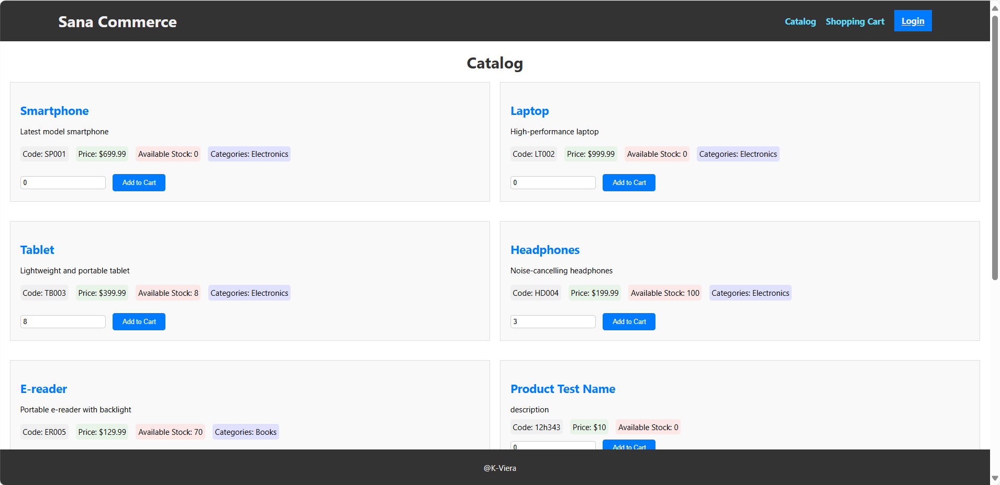
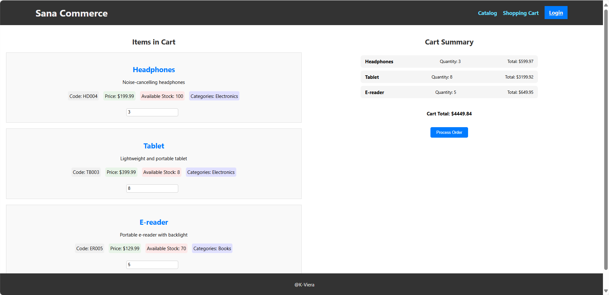
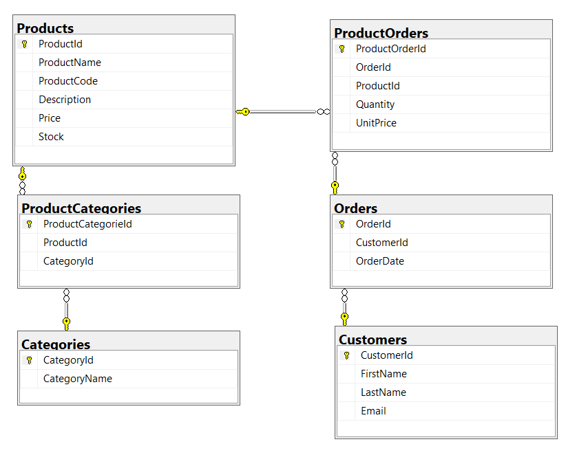

# Sana Commerce Web Shop

Welcome to the Sana Commerce Web Shop project! This project is designed as a basic simulation of a web shop, showcasing a catalog of products and a shopping cart functionality. It is built using React for the frontend and .Net Core for the backend, with a database designed to store data for product categories, products, customers, and orders.
## Catalog View

## Shopping Cart View

## Getting Started

To get started with this project, please follow the instructions provided in the README files located in both the `SanaCommerceBack` and `SanaCommerceFront` directories.

[Backend README](../../../../../c:/Users/Kevin/Personal/SanaCommerceRepo/SanaCommerceBack/README.md)
[Frontend README](../../../../../c:/Users/Kevin/Personal/SanaCommerceRepo/SanaCommerceFront/README.md)

## Project Structure

The project is divided into two main parts:

- **SanaCommerceBack**: The backend of the application, built with .Net Core. It handles the business logic, including interactions with the database.
- **SanaCommerceFront**: The frontend of the application, created with React. It provides the user interface for the web shop.

### Backend

The backend is located in the `SanaCommerceBack` directory. It uses .Net Core 8.0 and includes dependencies such as HotChocolate for GraphQL support and Swashbuckle for Swagger/OpenAPI integration.

### Frontend

The frontend is located in the `SanaCommerceFront` directory. It is a React application bootstrapped with Create React App, utilizing libraries such as Redux Toolkit for state management and React Router for navigation.

## Features

### Catalog

- **Product Listing**: Displays title, Product Code, small description, price, and available stock.
- **Shopping Cart**: Allows users to add products to a virtual shopping cart with a specific quantity.
- **Paging**: Limits the display to a maximum of 10 products per page.
- **Stock Validation**: Checks if the desired quantity of a product is available before adding it to the shopping cart.

### Shopping Cart

- **Product Listing**: Shows title, Product Code, Quantity, and Price of products added to the cart.
- **Totals**: Calculates and displays the total price by line and a summary of the entire order.
- **Quantity Editing**: Enables users to change the quantity of each product in the cart.
- **Deleting**: Allows users to remove products from the cart.
- **Process Order**: Users can create an order with the list of products in the shopping cart.

## Database Design

The database is designed to support the web shop's functionality, including relationships between products, categories, customers, and orders. For details on the database schema, please refer to the database design documents and scripts located in the project repository at `Files` folder.

- Create tables script: [CreateTablesScript.sql](./Files/CreateTablesScript.sql)
- Populate tables script: [PopulateTablesScript.sql](./Files/PopulateTablesScript.sql)

